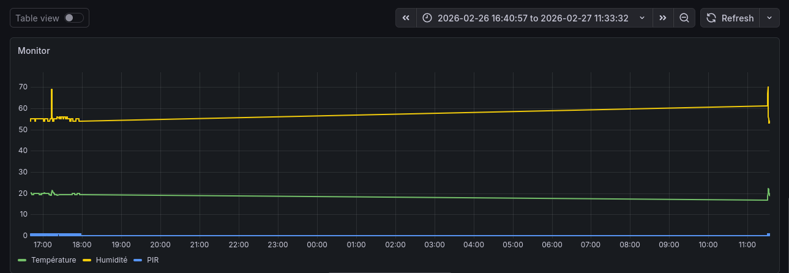

# Building Guardian

**Système IoT de surveillance de bâtiments** avec ESP8266, capteurs DHT11/PIR, MQTT, alertes Make.com et visualisation Grafana.



---

## Table des matières

- [Vue d'ensemble](#-vue-densemble)
- [Architecture](#-architecture)
- [Matériel requis](#-matériel-requis)
- [Installation](#-installation)
- [Configuration Make.com](#-configuration-makecom)
- [Documentation technique](#-documentation-technique)
- [Utilisation](#-utilisation)
- [Dépannage](#-dépannage)

---

##  Vue d'ensemble

Building Guardian est un système de monitoring temps réel pour espaces intérieurs qui surveille :
- **Température** (°C)
- **Humidité** (%)
- **Détection de mouvement** (PIR)

Les données sont collectées via MQTT, stockées dans SQLite, et des alertes automatiques sont envoyées par email via Make.com.

---

## Architecture

```
┌─────────────────┐
│  ESP8266 + DHT11│
│      + PIR      │  WiFi
└────────┬────────┘
         │ MQTT (port 1883)
         ↓
┌────────────────────────────────────────┐
│     Raspberry Pi (Broker MQTT)         │
│  ┌──────────────────────────────────┐  │
│  │   mqtt_data.py (Python)          │  │
│  │   ├─ Subscriber MQTT (#)         │  │
│  │   ├─ SQLite (mqtt_data.db)       │  │
│  │   └─ Alertes → Make.com Webhook  │  │
│  └──────────────────────────────────┘  │
└────────┬────────────────────────────────┘
         │
         ├──→ Grafana (Visualisation)
         └──→ Make.com → Email

```

### Flux de données

1. **ESP8266** publie `{"temp":22.5,"hum":55,"pir":1}` sur topic MQTT `salleXX`
2. **Python script** (`mqtt_data.py`) :
   - Reçoit les données via `mosquitto`
   - Sauvegarde dans SQLite
   - Compare avec seuils (TEMP > 25°C, HUM > 60%)
   - Envoie webhook Make.com si dépassement
3. **Make.com** traite le webhook et envoie un email d'alerte
4. **Grafana** lit SQLite pour graphiques temps réel

---

## Matériel requis

### ESP8266 (par salle)
- **1x ESP8266** (NodeMCU, Wemos D1 Mini)
- **1x DHT11** (température + humidité)
- **1x HC-SR501** (capteur PIR mouvement)
- Câbles jumper + breadboard

### Serveur central
- **Raspberry Pi** (3/4/Zero 2W) ou ordinateur Linux
- Connexion réseau local

---

## Installation

### 1. Raspberry Pi / Serveur

```bash
# Cloner le projet
git clone https://github.com/Tarikokc/building-guardian.git
cd building-guardian

# Installer dépendances
sudo apt update
sudo apt install mosquitto mosquitto-clients python3-pip -y
pip3 install paho-mqtt requests

# Démarrer Mosquitto
sudo systemctl enable mosquitto
sudo systemctl start mosquitto

# Lancer le script MQTT
python3 mqtt_data.py
```

### 2. ESP8266 (Arduino IDE)

**Bibliothèques requises** :
- ESP8266WiFi
- PubSubClient
- DHT sensor library

**Configuration** (`arduino/test_sensor.ino`) :
```cpp
const char* ssid = "VotreWiFi";
const char* password = "VotreMotDePasse";
const char* mqtt_server = "192.168.1.X"; // IP du Raspberry Pi
```

**Upload** vers l'ESP8266.

---

## Configuration Make.com

### Créer un scénario d'alerte email

#### Étape 1 : Webhook
1. **Créer un nouveau scénario** sur Make.com
2. **Ajouter module** : `Webhooks → Custom Webhook`
3. **Copier l'URL** générée (format : `https://hook.eu1.make.com/xxxxx`)
4. **Remplacer** dans `mqtt_data.py` :
   ```python
   WEBHOOK = "https://hook.eu1.make.com/VOTRE_WEBHOOK_ID"
   ```

#### Étape 2 : Parser JSON
1. **Ajouter module** : `JSON → Parse JSON`
2. **Data structure** :
   ```json
   {
     "alerte": "TEMP",
     "salle": "salle1",
     "valeur": 27.5,
     "seuil": 25,
     "topic": "salle1"
   }
   ```

#### Étape 3 : Envoyer email
1. **Ajouter module** : `Email → Send an Email` (Gmail, Outlook, etc.)
2. **Configurer** :
   - **To** : `votre@email.com`
   - **Subject** : `🚨 Alerte {{alerte}} - {{salle}}`
   - **Content** :
     ```
     Alerte détectée !
     
     Type : {{alerte}}
     Salle : {{salle}}
     Valeur : {{valeur}}
     Seuil : {{seuil}}
     Topic MQTT : {{topic}}
     
     Timestamp : {{now}}
     ```

#### Étape 4 : Activer
- **Scheduling** : `Immediately as data arrives`
- **Save** et activer le scénario

### Test du webhook

```bash
curl -X POST -H "Content-Type: application/json" \
  -d '{"alerte":"TEMP","salle":"test","valeur":27,"seuil":25,"topic":"test"}' \
  https://hook.eu1.make.com/VOTRE_WEBHOOK_ID
```

Vérifiez votre email → alerte reçue ✅

---

## Documentation technique

### Format MQTT

**Topic** : `salleXX` (XX = 2 derniers caractères MAC ESP)

**Payload JSON** :
```json
{
  "temp": 22.5,
  "hum": 55.0,
  "pir": 1
}
```

### Base de données SQLite

**Table `mesures`** :

| Colonne    | Type    | Description                    |
|------------|---------|--------------------------------|
| id         | INTEGER | Clé primaire auto-incrémentée |
| timestamp  | TEXT    | ISO 8601 (ex: 2026-02-27T10:15)|
| topic      | TEXT    | Topic MQTT                     |
| temp       | REAL    | Température (°C)               |
| hum        | REAL    | Humidité (%)                   |
| pir        | INTEGER | Mouvement (0=non, 1=oui)      |

### Seuils d'alerte

Modifiables dans `mqtt_data.py` :
```python
TEMP_MAX = 25  # °C
HUM_MAX = 60   # %
```

### Scripts disponibles

- **`mqtt_data.py`** : Subscriber MQTT + BDD + Alertes
- **`run_grafana.sh`** : Lancement Grafana (Docker)
- **`arduino/`** : Code ESP8266

---

## Utilisation

### Démarrage complet

```bash
# Terminal 1 : Logs MQTT
python3 mqtt_data.py

# Terminal 2 : Grafana (optionnel)
bash run_grafana.sh
```

### Test manuel

```bash
# Publier données test
mosquitto_pub -h localhost -t test/salle1 -m '{"temp":27,"hum":65,"pir":1}'

# Observer logs Python
# Vérifier email Make.com
```

### Visualisation Grafana

1. **Accéder** : `http://localhost:3000`
2. **Ajouter datasource** : SQLite (`mqtt_data.db`)
3. **Créer dashboard** :
   - Graph température : `SELECT timestamp, temp FROM mesures`
   - Graph humidité : `SELECT timestamp, hum FROM mesures`
   - Heatmap PIR : `SELECT timestamp, pir FROM mesures`

---

## Dépannage

### ESP ne se connecte pas au WiFi
```cpp
Serial.println(WiFi.scanNetworks()); // Vérifier réseaux disponibles
```
- Vérifier SSID/password
- Tester avec hotspot mobile

### MQTT non reçu
```bash
# Tester Mosquitto
mosquitto_sub -h localhost -t "#" -v

# Vérifier firewall
sudo ufw allow 1883/tcp
```

### Alertes Make.com non reçues
- Vérifier URL webhook dans `mqtt_data.py`
- Tester avec `curl` (voir section Make.com)
- Vérifier logs Make.com (History)

### SQLite verrouillé
```bash
# Si erreur "database is locked"
pkill -f mqtt_data.py
python3 mqtt_data.py
```

---

## Exemple de données

**Console ESP8266** :
```
WiFi connecté
MQTT connecté
✓ salleA2: {"temp":23.5,"hum":58,"pir":0}
✓ salleA2: {"temp":24.1,"hum":59,"pir":1}
```

**Logs Python** :
```
Connecté MQTT (code 0) → BDD + Alertes ON
salleA2: T=23.5° H=58% P=0
salleA2: T=24.1° H=59% P=1
```

**Email reçu** (si temp > 25°C) :
```
Alerte TEMP - salleA2

Type : TEMP
Salle : salleA2
Valeur : 27.5
Seuil : 25
Topic MQTT : salleA2

Timestamp : 2026-02-27T10:42:15
```

---

## Licence

MIT License - Libre d'utilisation et modification.

## Auteur

**Tarik**  - https://github.com/Tarikokc
**Alyssa** - https://github.com/Lylyss97x

---

## Liens utiles

- Documentation MQTT : https://mqtt.org/
- Paho Python : https://eclipse.dev/paho/index.php?page=clients/python/index.php
- Make.com Webhooks : https://www.make.com/en/help/tools/webhooks
- Grafana : https://grafana.com/
